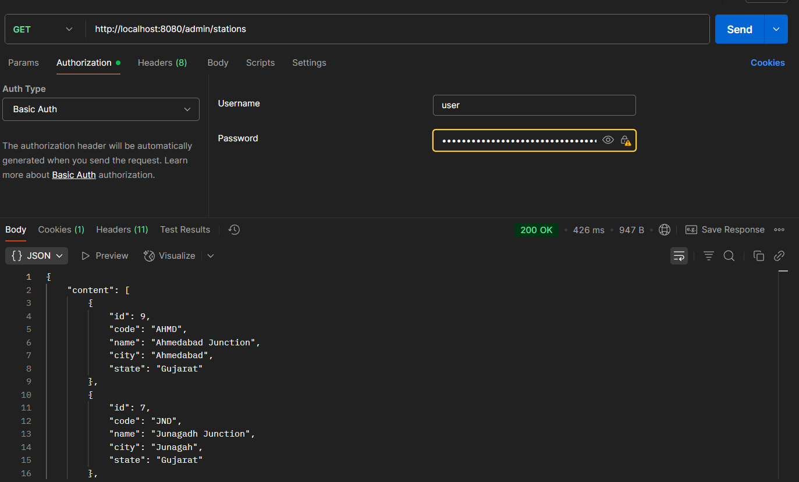
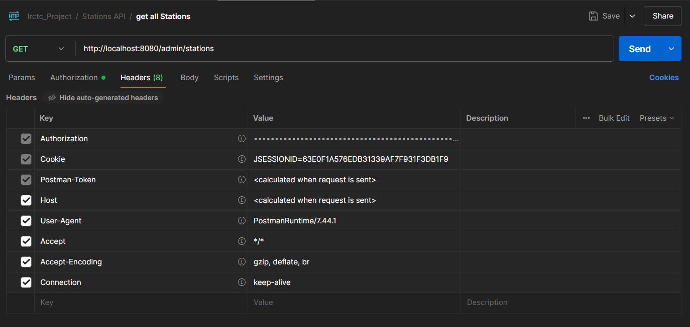
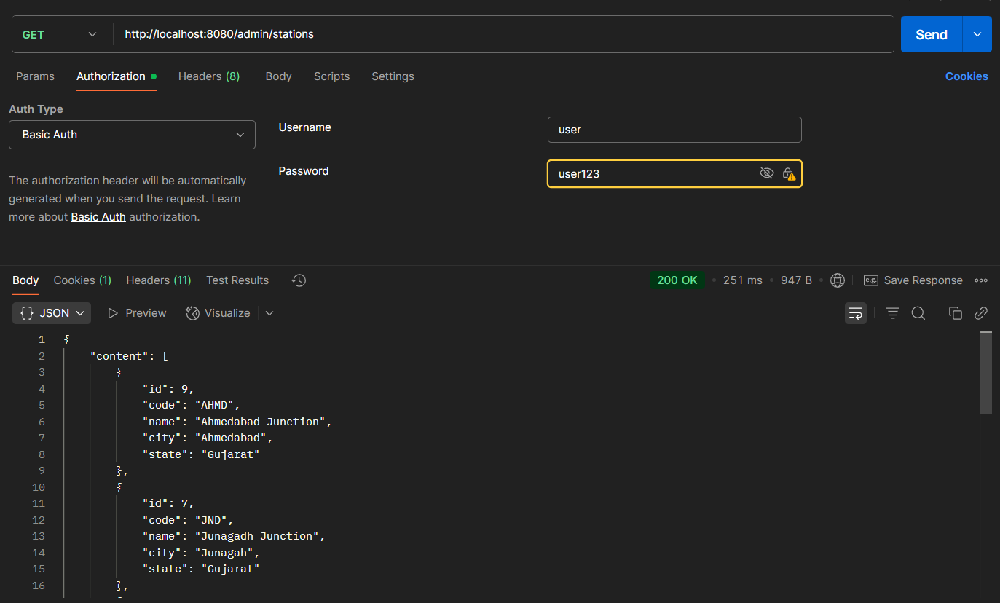
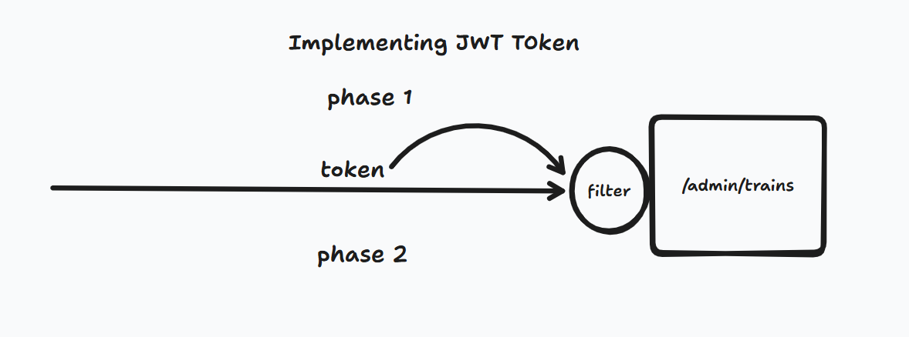
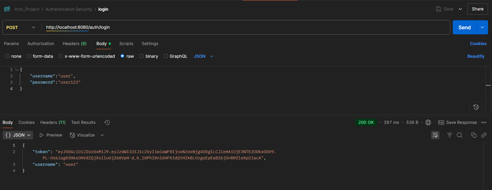
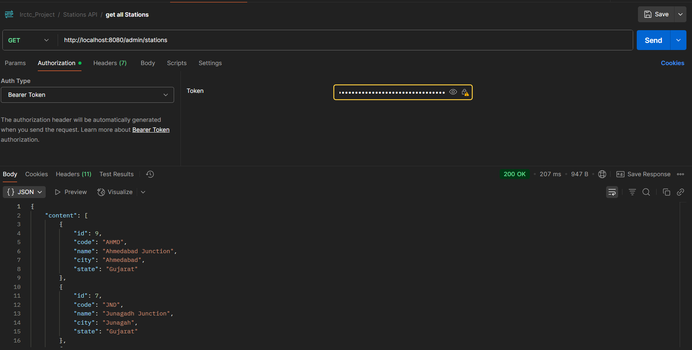

# IRCTC Backend

### Security : 

    1. We requird "Spring Security" depedency.
        <dependency>
          <groupId>org.springframework.boot</groupId>
          <artifactId>spring-boot-starter-security</artifactId>
        </dependency>

 Password : generated when we compile.

        -> This by default provide two Authentication.
            i.  Form base Authentication
            ii. Basic Authentication

        -> The problem of basic auth. is it pass 
            username and password every time when
            we send request.

        ->We can see this in Postman 
            Headers
                |-> Hidden
                        |-> Authorization  (Scroll up)
    
    2. We require the user.
        -there are different ways to create user.
            i. Default user and password Generated.
            ii. we add user to application.properties file
            iii. we customise the User Detail Servise 
                (with data base also)

    3. Now we will do Token Base Authentication

    4. We require JWT related libraries...

        ==================================================================
        
        - JJWT API
            
        (https://mvnrepository.com/artifact/io.jsonwebtoken/jjwt-api)
        
            -select the latest version current: 0.12.6

            <!-- https://mvnrepository.com/artifact/io.jsonwebtoken/jjwt-api -->
            <dependency>
                <groupId>io.jsonwebtoken</groupId>
                <artifactId>jjwt-api</artifactId>
                <version>0.12.6</version>
            </dependency>

            -This contain only inerfaces and inatilizations.

        =================================================================

        - JJWT inplementations

            <dependency>
                <groupId>io.jsonwebtoken</groupId>
                <artifactId>jjwt-impl</artifactId>
                <version>0.12.6</version>
                <scope>runtime</scope>
            </dependency>
        
        =================================================================
           
        - JJWT Jackson   (for Serilization & DeSerilization )

            <!-- https://mvnrepository.com/artifact/io.jsonwebtoken/jjwt-jackson -->
            <dependency>
                <groupId>io.jsonwebtoken</groupId>
                <artifactId>jjwt-jackson</artifactId>
                <version>0.12.6</version>
                <scope>runtime</scope>
            </dependency>
        
        
    

## 1.  Create CustomUserDatailServise.java

    import org.springframework.security.core.userdetails.User;
    import org.springframework.security.core.userdetails.UserDetails;
    import org.springframework.security.core.userdetails.UserDetailsService;
    import org.springframework.security.core.userdetails.UsernameNotFoundException;
    import org.springframework.stereotype.Service;

    @Service
    public class CustomUserDetailService implements UserDetailsService
    {
    
        //    ❌❌  It is giving Circular Depedenciey
        
        //    PasswordEncoder passwordEncoder;
        //
        //    // Constructor Autowired
        //    public CustomUserDetailService(PasswordEncoder passwordEncoder) {
        //        this.passwordEncoder = passwordEncoder;
        //    }
    
        @Override
        public UserDetails loadUserByUsername(String username) throws UsernameNotFoundException
        {
            UserDetails user = User.builder()
                    .username("user")
                    .password("{noop}user123")
                    .roles("USER")
                    .build();
    
            if (user.getUsername().equals(username))
            {
                return user;
            }
            else
            {
                throw new UsernameNotFoundException("user not found with this username" + username);
            }
        }
    }

## 2. Create SecuurityConfig.java 

    package irctc_project.security;

    import org.springframework.context.annotation.Bean;
    import org.springframework.context.annotation.Configuration;
    import org.springframework.security.authentication.AuthenticationManager;
    import org.springframework.security.config.annotation.authentication.configuration.AuthenticationConfiguration;
    import org.springframework.security.config.annotation.web.builders.HttpSecurity;
    import org.springframework.security.config.http.SessionCreationPolicy;
    import org.springframework.security.web.SecurityFilterChain;
    import org.springframework.security.web.authentication.UsernamePasswordAuthenticationFilter;
    
    @Configuration
    public class SecuurityConfig
    {

        private JwtAuthenticationFilter authenticationFilter;
        private JWTAuthenticationEntryPoint authenticationEntryPoint;
    
        //Construction Autowire
        public SecuurityConfig(JwtAuthenticationFilter authenticationFilter,
                               JWTAuthenticationEntryPoint authenticationEntryPoint)
        {
            this.authenticationFilter = authenticationFilter;
            this.authenticationEntryPoint = authenticationEntryPoint;
        }
    
    //    @Bean
    //    public PasswordEncoder passwordEncoder()
    //    {
    //        return new BCryptPasswordEncoder();
    //    }
    
        @Bean
        public AuthenticationManager authenticationManager (AuthenticationConfiguration authenticationConfiguration) throws Exception {
            return authenticationConfiguration.getAuthenticationManager();
        }
    
    
        @Bean
        public SecurityFilterChain securityFilterChain(HttpSecurity httpSecurity)throws Exception
        {
            // Make the login url public
            // and
            // others are private
            httpSecurity.csrf(e->e.disable()).authorizeHttpRequests( request ->{
                request.requestMatchers("/auth/login")
                        .permitAll()
                        .anyRequest()
                        .authenticated();}
            );
    
            //Backend will not store any thing
            //We make Session stateless
            httpSecurity.sessionManagement(session-> session.sessionCreationPolicy(SessionCreationPolicy.STATELESS));
    
    
            //If error occur then this class will run
            httpSecurity.exceptionHandling(e-> e.authenticationEntryPoint(authenticationEntryPoint));
    
            //authenticationFilter will run before
            httpSecurity.addFilterBefore(authenticationFilter , UsernamePasswordAuthenticationFilter.class);
    
    
    
            return httpSecurity.build();
    
    
        }
    }

## 3. Create JWTAuthenticationEntryPoint.java

=> This class will handel the error when we request the server.

=> When we try to access API but can't access it then this Class will run.

    
    package irctc_project.security;
    
    import jakarta.servlet.ServletException;
    import jakarta.servlet.http.HttpServletRequest;
    import jakarta.servlet.http.HttpServletResponse;
    import org.springframework.security.core.AuthenticationException;
    import org.springframework.security.web.AuthenticationEntryPoint;
    import org.springframework.stereotype.Component;
    
    import java.io.IOException;
    
    //@Component : we can easily autowired
    
    @Component
    public class JWTAuthenticationEntryPoint implements AuthenticationEntryPoint
    {
        @Override
        public void commence(HttpServletRequest request,
        HttpServletResponse response,
        AuthenticationException authException) throws IOException, ServletException
        {
        
    
            response.setStatus(HttpServletResponse.SC_UNAUTHORIZED);
    
            response.setContentType("application/json");
            response.getWriter().write("{\"error\": \"Unauthorized\", \"message\": \"" + authException.getMessage() + "\"}");
    
        }
    }

## 4. Create JwtHelper.java

=> This is use to :  Create Token, Validate Token, getClaims, Expire Token 

    package irctc_project.security;
    
    import io.jsonwebtoken.Claims;
    import io.jsonwebtoken.Jwts;
    import io.jsonwebtoken.SignatureAlgorithm;
    import io.jsonwebtoken.security.Keys;
    import jakarta.annotation.PostConstruct;
    import org.springframework.security.core.userdetails.UserDetails;
    import org.springframework.stereotype.Component;
    import java.security.Key;
    import java.util.Date;
    
    @Component
    public class JwtHelper
    {
        private static final long JWT_VALIDITY = 5 * 60 * 1000; // 5 min.
    
        private final String SECRET = "vbfbhavashvvbzbxnvbSdvhgfauufbsfvyybrybfhdghgfskahskhfsvvfrgfjgadssbgfvhgsfaeryhhhjfaghgs";
    
        private Key key;
    
    
        //It will assign after object create
        @PostConstruct
        public void init()
        {
            this.key = Keys.hmacShaKeyFor(SECRET.getBytes());
        }
    
    
        //👉👉 GENERATE TOKEN :
    
        public String generateToken(UserDetails userDetails)
        {
            return Jwts.builder()
                    .setSubject(userDetails.getUsername())
                    .setIssuedAt(new Date())
                    .setExpiration(new Date(System.currentTimeMillis() + JWT_VALIDITY))
                    .signWith(key , SignatureAlgorithm.HS512)
                    .compact();
        }
    
        //👉👉 This is like Map Structure
        //👉👉 This will return JWT Stander Claims names
    
        public Claims getClaims(String token)
        {
            return Jwts.parser()
                    .setSigningKey(key)
                    .build()
                    .parseClaimsJws(token)
                    .getBody();
        }
    
    
        //👉👉 Get USERNAME from token
    
        public String getUsernameFromToken(String token)
        {
            return getClaims(token).getSubject();
        }
    
    
        //👉👉 VALIDATE TOKEN
    
        public boolean isTokenValid(String token , UserDetails userDetails)
        {
            String username = getUsernameFromToken(token);
    
            return username.equals(userDetails.getUsername()) && !isTokenExpired(token);
        }
    
    
        //👉👉 EXPIRE TOKEN ?
    
        private boolean isTokenExpired(String token)
        {
            return getClaims(token).getExpiration().before(new Date());
        }
    
    
    
        //👉👉 REFRESH TOKEN :
}

## 5. Create JwtAuthenticationFilter.java (Phase 2)

=> This filter will authenticate the Token.

=> This will authenticate token every time request comes

package irctc_project.security;

    import io.jsonwebtoken.ExpiredJwtException;
    import io.jsonwebtoken.MalformedJwtException;
    import jakarta.servlet.FilterChain;
    import jakarta.servlet.ServletException;
    import jakarta.servlet.http.HttpServletRequest;
    import jakarta.servlet.http.HttpServletResponse;
    import org.springframework.security.authentication.UsernamePasswordAuthenticationToken;
    import org.springframework.security.core.context.SecurityContextHolder;
    import org.springframework.security.core.userdetails.UserDetails;
    import org.springframework.security.core.userdetails.UserDetailsService;
    import org.springframework.security.web.authentication.WebAuthenticationDetailsSource;
    import org.springframework.stereotype.Component;
    import org.springframework.web.filter.OncePerRequestFilter;
    
    import java.io.IOException;
    
    @Component
    public class  JwtAuthenticationFilter extends OncePerRequestFilter
    {

        JwtHelper jwtHelper;
    
        UserDetailsService userDetailsService;
    
        //Construction Autowired
        public JwtAuthenticationFilter(JwtHelper jwtHelper, UserDetailsService userDetailsService) {
            this.jwtHelper = jwtHelper;
            this.userDetailsService = userDetailsService;
        }
    
    
        //👉👉 For every request it will work
    
        @Override
        protected void doFilterInternal(HttpServletRequest request,
                                        HttpServletResponse response,
                                        FilterChain filterChain) throws ServletException, IOException
        {
            // Bearer vdbfbvkjbvfwgbvbbcgerigvkvbhwtgadfvklfiherh
            String authorisedHeader= request.getHeader("Authorization");
    
            String username = null;
            String token = null;
    
            if(authorisedHeader != null && authorisedHeader.startsWith("Bearer "))
            {
                try
                {
                    // Remove "Bearer "  prefix
                    token = authorisedHeader.substring(7);
    
                    username = jwtHelper.getUsernameFromToken(token);
    
                    //👉👉 Username not equal to null
                    //👉👉 Security Context ni ander Authentication na hovu joye
    
                    if(username != null && SecurityContextHolder.getContext().getAuthentication() == null)
                    {
                        UserDetails userDetails = userDetailsService.loadUserByUsername(username);
    
                        //👉👉 if token is valid then we will Set it TO SECURIETY CONTEXT
    
                        if(jwtHelper.isTokenValid(token,userDetails))
                        {
                            //👉👉 we have to add data in SecurityCotext Holder:
    
                            //👉 Create Authentication by passing User details
                            UsernamePasswordAuthenticationToken authentication =
                                    new UsernamePasswordAuthenticationToken(
                                            userDetails ,
                                            null ,
                                            userDetails.getAuthorities());
    
                            //👉 it will add ip related info , session related EXTRA INFORMATIONS
                            authentication.setDetails(new WebAuthenticationDetailsSource().buildDetails(request));
    
    
                            //👉 Set the authentication to SecurityContextHolder
                            SecurityContextHolder.getContext().setAuthentication(authentication);
    
                            //✅✅✅✅✅✅✅
    
                            // IF this authetication not get set to the SecurityContext then it is not authenticated.
    
                            //✅✅✅✅✅✅✅
                        }
    
                    }
    
    
                }//👇👇👇👇👇👇👇 This type of SPECIFIC EXCEPTION will come 👇👇👇👇👇👇👇👇👇
    
                catch (IllegalArgumentException ex)
                {
                    System.out.println("Unable to get JWT Token");
                    ex.printStackTrace();
                }
                catch (ExpiredJwtException ex)
                {
                    System.out.println("JWT Token has expired");
                    ex.printStackTrace();
                }
                catch (MalformedJwtException ex)
                {
                    System.out.println("Invalid JWT Token");
                    ex.printStackTrace();
                }
                catch (Exception e)
                {
                    System.out.println("Invalid Token");
                    System.out.println(e.getStackTrace());
                }
    
    
            }
            else
            {
                System.out.println("Invalid Authorization Header");
            }
    
            //👇👇 It will passs the request as it get Authenticated
    
            filterChain.doFilter(request,response);

        }
    }

## 6. Create AuthenticationController.java

    package irctc_project.Controller;

    import irctc_project.record.ErrorResponse;
    import irctc_project.record.JwtResponse;
    import irctc_project.record.LoginRequest;
    import irctc_project.security.JwtHelper;
    import org.springframework.http.HttpStatus;
    import org.springframework.http.ResponseEntity;
    import org.springframework.security.authentication.AuthenticationManager;
    import org.springframework.security.authentication.BadCredentialsException;
    import org.springframework.security.authentication.UsernamePasswordAuthenticationToken;
    import org.springframework.security.core.userdetails.UserDetails;
    import org.springframework.security.core.userdetails.UserDetailsService;
    
    
    import org.springframework.web.bind.annotation.PostMapping;
    import org.springframework.web.bind.annotation.RequestBody;
    import org.springframework.web.bind.annotation.RequestMapping;
    import org.springframework.web.bind.annotation.RestController;
    
    @RestController
    @RequestMapping("/auth")
    public class AuthenticationController
    {

        private AuthenticationManager authenticationManager;
        private UserDetailsService userDetailsService;
        private JwtHelper jwtHelper;
    
        //Construction Autowired
        public AuthenticationController(AuthenticationManager authenticationManager,
                                        UserDetailsService userDetailsService,
                                        JwtHelper jwtHelper)
        {
            this.authenticationManager = authenticationManager;
            this.userDetailsService = userDetailsService;
            this.jwtHelper = jwtHelper;
        }
    
        @PostMapping("/login")
        public ResponseEntity<?> loging(@RequestBody LoginRequest loginRequest)
        {
            // 👉👉👉 First we authenticate the user.
    
            //👉 AuthenticationManager will authenticate the user.
    
            try
            {
                //👉👉 This will create bunch of Username and Password
                UsernamePasswordAuthenticationToken authentication =
                        new UsernamePasswordAuthenticationToken
                                (loginRequest.username(),
                                        loginRequest.password());
    
                //👉👉 we will pass it to Authenticate it.
                this.authenticationManager.authenticate(authentication);
    
    
                //✅✅✅✅ NOW we will Geerate Token
    
                UserDetails userDetails = userDetailsService.loadUserByUsername(loginRequest.username());
    
                String token = this.jwtHelper.generateToken(userDetails);
    
                JwtResponse jwtResponse = new JwtResponse(
                        token,
                        loginRequest.username()
                );
    
                return new ResponseEntity<>(jwtResponse , HttpStatus.OK);
    
    
            }catch (BadCredentialsException e)
            {
                ErrorResponse errorResponse = new ErrorResponse(
                        "Invalid credencials",
                        "403",
                        false);
    
                e.printStackTrace();
                return new ResponseEntity<>(errorResponse, HttpStatus.BAD_REQUEST);
            }
        }

    }

# Generate Token 

-At:  http://localhost:8080/auth/login

-   Copy this token and pass to any other API's

# Access other API usign Token

    |-> Authorization 
        |->Bearer Token
            |-> Paste the token

